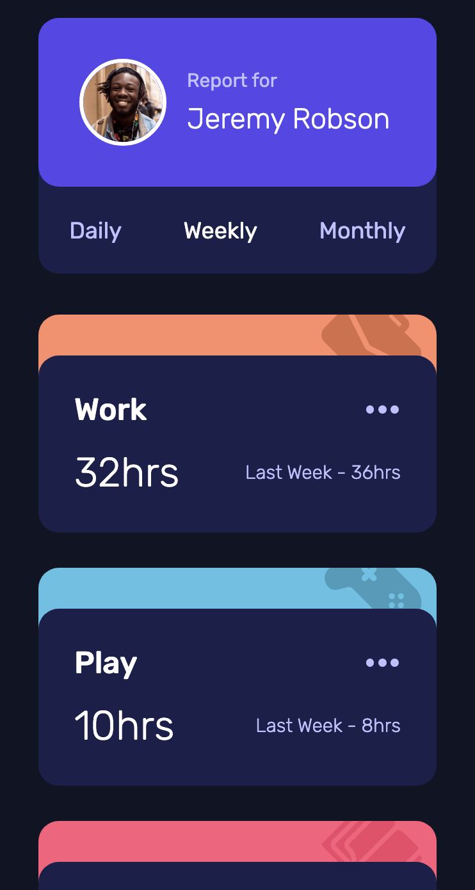
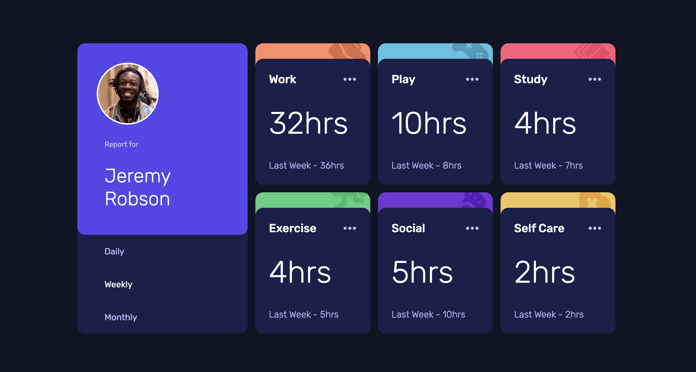

# Quiz 2 - Time tracking dashboard solution

This is a solution to the [Time tracking dashboard Quiz 2 challenge]

## Table of contents

- [Overview](#overview)
  - [The challenge](#the-challenge)
  - [Screenshot](#screenshot)
  - [Links](#links)
- [My process](#my-process)
  - [Built with](#built-with)
  - [What I learned](#what-i-learned)
  - [Continued development](#continued-development)
  - [Useful resources](#useful-resources)
- [Author](#author)
- [Acknowledgments](#acknowledgments)

## Overview

### The challenge

Users should be able to:

- View the optimal layout for the site depending on their device's screen size
- See hover states for all interactive elements on the page
- Switch between viewing Daily, Weekly, and Monthly stats

### Screenshot
- Mobile Layout

- Desktop Layout

### Links

- Solution URL: [Add solution URL here](https://your-solution-url.com)
- Live Site URL: [Add live site URL here](https://your-live-site-url.com)

## My process

### Built with

- Semantic HTML5 markup
- Mobile-first workflow
- CSS custom properties
- Flexbox
- JS Vanilla

### What I learned

By doing this challenge, I was able to implement basic knowledge of HTML, CSS, and JS. Also, I was able to learn how JSON works for the first time.

### Continued development

In the future, I would like to improve my coding skills. I also would like to try this challenge by implementing CSS Grid instead of flexbox, as I heard that it is a better choice than using a flexbox layout.

### Useful resources

- [w3schools](https://www.w3schools.com/) - This helped me when I struggle with concepts I'm not really familiar with. I really liked the pattern shown on this website as it gives us clear and concise explanations completed with examples.

## Your Detail 

- Full Name - Clarissa Audrey Fabiola Kusnadi
- StudentID - 2602118490
- BINUS Email - clarissa.kusnadi@binus.ac.id
